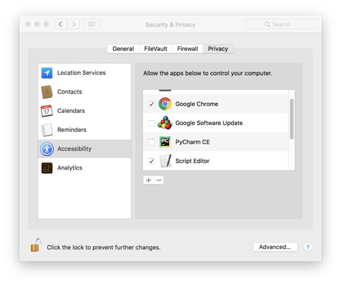

# csv-toicloudkeychain
AppleScript that will read a CSV file containing URL, username and password data and import this to iCloud KeyChain via Safari.

## Preparing credentials from Chrome
To use this tool you should manually export credentials from Google Chrome into .csv file. In the browser, switch to chrome://flags/#PasswordExport and enable option #PasswordExport.

Reload Chrome

Go to chrome://settings/passwords, click Other actions button, then click Export and save the .csv file in any convinient location

## CSV Layout
Export in chrome and than run:
For Dutch:
>cat Chrome-wachtwoorden.csv  | awk -F ',' '{print $2","$3","$4}' > passwords-prepared.csv
For English:
>cat Chrome-Passwords.csv  | awk -F ',' '{print $2","$3","$4}' > passwords-prepared.csv

Create a CSV without headers with data in the below order.
>url,username,password

For example, import an entry for the user doggo at woof.org.
>woof.org,doggo,secretbonepass

## Accessibility Permissions
Script editor must be given permission under System Preferences - Security & Privacy - Accessibility to run. Ensure you remove this after you have finished running the script.

